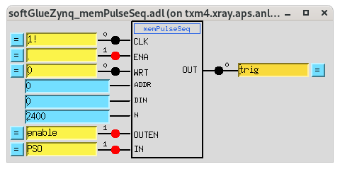
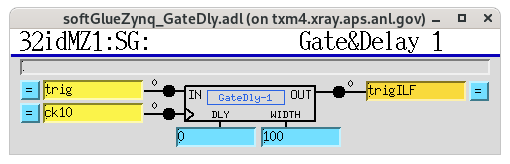
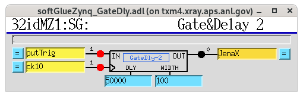
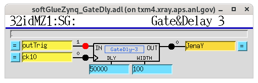
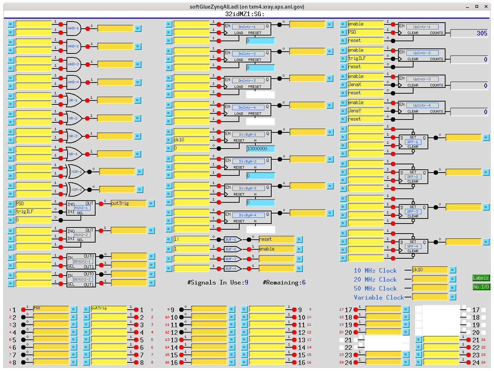

===================
Beamline components
===================

Reference inventory of the physical hardware that makes up 32-ID, walked
from the source to the detector. Each component is listed once, with the
fields needed to drive it (Family / role / intrinsic specs) and the
fields needed to reason about how it moves relative to everything else
(what it is mounted on, what rides on top of it).

This page is the source of truth for the beamline as an assembly. It
follows the same style as the 2-BM ``item_020`` beamline-components
inventory.

.. note::

   "Mounted on" captures the kinematic chain, distinct from compositional
   ownership. A stage mounted on the rotary co-rotates with it; the same
   stage mounted under the rotary translates the rotation axis in lab
   coordinates. Alignment, error propagation, and limit-handling all
   depend on which is which.

Coded aperture (Jena NV200D piezo)
~~~~~~~~~~~~~~~~~~~~~~~~~~~~~~~~~~

.. note::

   These are the **same two physical controllers and actuator**
   previously operated at 2-BM (see the 2-BM ``item_020`` beamline
   components page). They were relocated to 32-ID and re-addressed on the
   32-ID private subnet. Axis identity is fixed by controller **MAC
   address** (unchanged by the move), not by IP: the MAC-to-axis binding
   is the same as at 2-BM.

:Role: Beam-shaping coded aperture mounted in the beam upstream of the
   sample. The aperture is stepped through a list of (X, Y) piezo
   positions during a tomography fly-scan to produce randomised /
   dithered sampling for compressive-sensing imaging reconstructions.
:Family: (Pending — neither Camera nor Stage in the traditional
   sense; the mask itself is a beam-path optical element with its
   own positioning piezo; the eventual Family choice for the
   mask is a separate decision from the piezo controller below.)
:cora Asset: ``CodedApertureFineDrive`` (piezo-controller Asset). Family:
   ``MotionController``. Inherited from the 2-BM registration
   (operator-confirmed 2026-06-19); ``SampleFineDrive`` was an earlier
   provisional placeholder and is wrong — the device does not move the
   sample.
:Hutch: 32-ID (TBD — confirm which 32-ID hutch the aperture is installed
   in)
:z position: TBD (fill in from the 32-ID beamline reference table once
   the aperture is positioned in the beam path)
:Hardware (controllers): **Two** Piezosystem Jena **NV200D/NET**
   controllers, one per piezo axis (not a single dual-channel
   controller). Each is Ethernet-attached and addressed via the
   vendor's Telnet interface on port 23 ("NV200/D NET>" prompt).
   Axis is bound to the MAC address (same as 2-BM); the 32-ID IPs and
   hostnames are new:

   ====  ===========================  ================  ============  =====================
   Axis  Hostname                     Controller IP     Vendor model  MAC address
   ====  ===========================  ================  ============  =====================
   X     ``piexo3.xray.aps.anl.gov``  ``10.54.102.8``   NV200D/NET    ``00-80-A3-6F-BD-6E``
   Y     ``piexo4.xray.aps.anl.gov``  ``10.54.102.46``  NV200D/NET    ``00-80-A3-6F-BD-64``
   ====  ===========================  ================  ============  =====================

   The axis↔MAC binding is the source of truth. Verify which MAC answers
   at each IP (``arp -a`` after ``ping``, or the Lantronix XPort web
   page) if the hostname-to-axis assignment is ever in doubt.

   Vendor datasheet: `NV200D-Datasheet.pdf
   <https://www.piezosystem.com/wp-content/uploads/2023/07/NV200D-Datasheet.pdf>`__.

   NOT the NV100D (which lacks the external trigger mode required
   for tomoscan fly-scan integration).
:Actuator: Piezosystem Jena XY flexure stage,
   **nanoSXY 120 CAP**, part number **T-223-06D** (the "D" suffix
   denotes the digital interface variant). Drawing: `nanoSXY-120-CAP
   <https://www.piezosystem.com/wp-content/uploads/2022/04/nanoSXY-120-CAP-Part-Drawing.pdf>`__
   (rev.01, Feb 2019). Key dimensions:

   .. list-table::
      :header-rows: 1
      :widths: 35 65

      * - Property
        - Value
      * - Travel per axis (nominal)
        - 120 µm
      * - Travel per axis (closed-loop)
        - 100 µm
      * - Clear aperture
        - Ø 12.5 mm (centred)
      * - Outer footprint
        - 82 × 79 × 30 mm
      * - Mounting
        - 4× M3 tapped + 4× Ø3 G7 reamed dowel holes (symmetric, on
          both sides); 32 mm / 54 mm / 60 mm hole-pattern centres
      * - Standard cable length
        - 1600 mm (voltage + sensor cables)
      * - Feedback
        - Capacitive (the ``CAP`` in the model)

   The clear aperture is what the coded-aperture mask itself is
   mounted into; the X / Y piezo motion moves the mask within the
   beam.
:Device configuration: Both controllers must be set to **Xon/Xoff**
   (software) flow control via the Lantronix XPort web interface for the
   EPICS support to work correctly.
:IOC: None deployed at 32-ID as of the relocation (the 2-BM deployment
   ran a ``JenaNV200D`` IOC on ``arcturus``). The triggered-step script
   talks to the controllers directly over Telnet; if an EPICS IOC is
   later added it must be stopped while the script runs.
:FPGA trigger: The FPGA sends a TTL pulse to the NV200D **TRG IN**
   connector (pin 3 of the I/O D-Sub, 0/3.3–5 V) to step to the next
   position during the camera readout interval. Each rising edge
   advances the actuator to the next buffered position.

   Per-axis wiring at 32-ID (same convention as 2-BM):

   =====  ================================================  ============  ===============================
   Axis   NV200D host (TRG IN)                              FPGA out      softGlue delay PV
   =====  ================================================  ============  ===============================
   X      ``piexo3.xray.aps.anl.gov`` (``10.54.102.8``)     ``out2``      ``32idMZ1:SG:GateDly-2_DLY``
   Y      ``piexo4.xray.aps.anl.gov`` (``10.54.102.46``)    ``out3``      ``32idMZ1:SG:GateDly-3_DLY``
   =====  ================================================  ============  ===============================

   Delay units are 10 MHz clock cycles (100 ns / count); set to
   detector exposure time + safety margin. The ``32idMZ1:``
   softGlueZynq prefix is confirmed against the IOC's own startup
   configuration at
   ``/net/s32dserv/xorApps/epics/synApps_MZ/ioc/32idMZ1/iocBoot/ioc32idMZ1/st.cmd``
   (``epicsEnvSet("PREFIX", "32idMZ1:")``) and verified on the
   beamline 2026-07-28.
:Programming procedure: Triggered-step buffer programming. Up to **1024
   positions** (onboard arbitrary-waveform-generator buffer maximum) are
   pre-loaded into each controller; the default is 256 per axis.
   Implementation ported into ``32id-procedures``,
   `procedures/nv200_trigger_step.py
   <https://github.com/xray-imaging/32id-procedures/blob/main/procedures/nv200_trigger_step.py>`__
   (official `nv200 Python library
   <https://pypi.org/project/nv200/>`__-based; connects to both
   controllers concurrently via ``asyncio``). The two controller IPs
   are already set to the 32-ID addresses above.

   Arguments: ``--n N`` (1 ≤ N ≤ 1024, default 256) and ``--random``
   (uniform sampling from the 0–100 µm stroke for compressive-sensing
   dithered sampling; default is evenly-spaced ``numpy.linspace``).
   ``--random`` is the operational mode for compressive-sensing
   reconstructions. After each generation the positions are saved to
   ``positions_x.txt`` / ``positions_y.txt`` in the current working
   directory as a per-Run provenance record.

   Operational constraint: each controller only accepts **one Telnet
   connection at a time**, so the EPICS IOC must be stopped before
   running the script (and restarted afterwards). Buffered positions live
   in controller RAM and are lost on power cycle unless persisted to
   EEPROM via the library's ``save_to_eeprom()``.

.. note::

   **Preconditions for the triggered-step run** (adapted from the 2-BM
   procedure): the dedicated ``nv200`` conda env is active
   (``conda activate nv200``); both controllers are reachable
   (``ping 10.54.102.8`` and ``ping 10.54.102.46``); and the
   coded-aperture stage is mechanically aligned so the 0–100 µm stroke
   maps to sensible aperture positions in the beam. (No ``JenaNV200D``
   IOC is deployed at 32-ID, so there is no IOC to stop.)

Softglue configuration for the coded-aperture fly-scan
~~~~~~~~~~~~~~~~~~~~~~~~~~~~~~~~~~~~~~~~~~~~~~~~~~~~~~

The softGlueZynq FPGA on ``32idMZ1:SG:`` implements the complete
trigger chain for coded-aperture fly-scans, from the raw PSO
position pulses out of the Aerotech controller through to the two
per-axis piezo step pulses. All of the blocks below live on the
``softGlueZynqAll.adl`` panel and can be edited via the caQtDM
interface running on ``txm4``.

Hardware identity (MicroZed carrier):

.. list-table::
   :header-rows: 1
   :widths: 20 45 35

   * - Field
     - Value
     - Notes
   * - IP
     - ``10.54.102.17``
     - 32-ID private subnet
   * - Hostname
     - ``mz-32id01``
     - TXM softGlue MicroZed
   * - MAC
     - ``00:19:B3:02:14:F5``
     - Bound to this unit
   * - IOC dir
     - ``/net/s32dserv/xorApps/epics/synApps_MZ/ioc/32idMZ1/``
     - Start with ``./start_epics_32idMZ1``

**Trigger chain overview** (in order along the signal path):

    PSO → memPulseSeq → GateDly-1 → trigILF → (MUX) → outTrig → GateDly-2 → JenaX → FPGA out2 → X-axis piezo → GateDly-3 → JenaY → FPGA out3 → Y-axis piezo

Camera-trigger side (PSO subset)
^^^^^^^^^^^^^^^^^^^^^^^^^^^^^^^^

The ``memPulseSeq`` block picks a subset of the PSO pulses to use
as camera triggers (interlaced-trigger pattern). It reads its
selection from a memory table pre-loaded via
``write_PSO_array()`` from `interlaced/fpga/macros_ILF.py
<https://github.com/decarlof/interlaced/blob/main/fpga/macros_ILF.py>`__
(e.g. ``m.write_PSO_array([0, 2, 4, 6])`` triggers only on PSO edges
0, 2, 4, 6). A deployed copy of the same file lives at
``/net/s32dserv/xorApps/epics/synApps_MZ/ioc/32idMZ1/32idMZ1App/op/python/macros_ILF.py``.

   ``memPulseSeq`` block on ``32idMZ1:SG:``. Inputs: ``PSO`` on
   ``IN``, ``enable`` on ``OUTEN``; N = 2400 (buffer depth).
   Output goes to the ``trig`` signal, which is then fed into
   ``GateDly-1``.

   ``GateDly-1`` — IN = ``trig`` (from ``memPulseSeq`` above),
   clock = ``ck10`` (10 MHz), ``DLY = 0``, ``WIDTH = 100``
   (10 µs). OUT is ``trigILF``, the interlaced-trigger signal.
   A downstream ``MUX2-1`` then selects between ``PSO`` and
   ``trigILF`` to drive ``outTrig`` (the actual camera trigger).

Piezo-step side (per-axis GateDly)
^^^^^^^^^^^^^^^^^^^^^^^^^^^^^^^^^^

Two additional GateDly blocks generate the step pulses that advance
the two NV200D controllers. Both take ``outTrig`` (the same camera
trigger routed to the detector) as input and produce a delayed
step pulse aligned to land during the frame readout interval,
**after** the sensor has integrated:

   ``GateDly-2`` — IN = ``outTrig`` + ``ck10``, ``DLY = 50000``
   (50000 × 100 ns = **5 ms** delay), ``WIDTH = 100`` (10 µs).
   OUT is the ``JenaX`` softGlue signal → FPGA ``out2`` →
   **X-axis** NV200D controller (``piexo3``,
   ``10.54.102.8``).

   ``GateDly-3`` — identical shape and settings. OUT is the
   ``JenaY`` softGlue signal → FPGA ``out3`` → **Y-axis** NV200D
   controller (``piexo4``, ``10.54.102.46``). Same 5 ms delay,
   10 µs pulse width.

Adjust ``DLY`` when the exposure time changes:

- ``DLY`` and ``WIDTH`` are in **10 MHz clock cycles**
  (100 ns per count).
- ``DLY = 50000`` → 5 ms. Increase for longer exposures so the
  piezo step happens after the sensor integrates.
- ``WIDTH = 100`` → 10 µs pulse (comfortably above the NV200D
  ``TRG IN`` minimum sensitivity).

PVs (set from the caQtDM Gate&Delay page or with ``caput``):

- ``32idMZ1:SG:GateDly-2_DLY`` and ``32idMZ1:SG:GateDly-2_WIDTH`` (X)
- ``32idMZ1:SG:GateDly-3_DLY`` and ``32idMZ1:SG:GateDly-3_WIDTH`` (Y)

Pulse-count verification
^^^^^^^^^^^^^^^^^^^^^^^^

Two dedicated ``UpCntr`` blocks on the ``softGlueZynqAll``
panel count the delivered step pulses so an operator can confirm
that both axes are stepping in lock-step with the camera:

   ``softGlueZynqAll.adl`` on ``32idMZ1:SG:``. Right column,
   top-to-bottom: ``UpCntr-1`` counts ``PSO`` (master pulse
   count), ``UpCntr-2`` counts ``trigILF`` (interlaced-trigger
   subset), ``UpCntr-3`` counts ``JenaX`` (X piezo pulse count),
   ``UpCntr-4`` counts ``JenaY`` (Y piezo pulse count). During any
   active scan ``UpCntr-3`` and ``UpCntr-4`` should stay within
   one count of each other (both stepped by the same camera
   trigger); drift between them means one of the two piezo trigger
   paths is dropping pulses.

The softGlue internal signal names ``JenaX`` and ``JenaY`` are set
to match the axis they drive: ``GateDly-2`` → ``JenaX`` → FPGA
``out2`` → Jena X controller; ``GateDly-3`` → ``JenaY`` → FPGA
``out3`` → Jena Y controller. Signal name, GateDly index, FPGA out
number, and axis are all consistent — same convention as 2-BM.

.. note::

   **32-ID vs 2-BM softGlue deployment.** At 2-BM the softGlueZynq
   IOC runs on the MicroZed and auto-starts at boot; the caQtDM
   interface is opened from ``arcturus`` via ``./start_caQtDM_2bmbMZ1``.
   At 32-ID the caQtDM interface runs on ``txm4`` against the
   ``32idMZ1:`` IOC (deployed under
   ``/net/s32dserv/xorApps/epics/synApps_MZ/ioc/32idMZ1/``); launch
   scripts are ``./start_epics_32idMZ1`` and
   ``./start_caQtDM_32idMZ1``. The FPGA firmware and block layout
   are otherwise identical between the two beamlines.

Projection Microscope softGlue (32idMZ2)
~~~~~~~~~~~~~~~~~~~~~~~~~~~~~~~~~~~~~~~~

Second softGlueZynq MicroZed at 32-ID, dedicated to the Projection
Microscope instrument (distinct from the TXM softGlue at
``32idMZ1:`` documented above). Stub entry — expand when this
instrument's trigger chain is documented in detail.

Hardware identity (MicroZed carrier):

.. list-table::
   :header-rows: 1
   :widths: 20 45 35

   * - Field
     - Value
     - Notes
   * - IP
     - ``10.54.102.27``
     - 32-ID private subnet
   * - Hostname
     - ``mz-32id02``
     - Projection Microscope softGlue MicroZed
   * - MAC
     - ``00:19:B3:02:14:F6``
     - Bound to this unit
   * - IOC dir
     - ``/net/s32dserv/xorApps/epics/synApps_MZ/ioc/32idMZ2/``
     - EPICS prefix ``32idMZ2:``

Interlaced-trigger helper (deployed copy of the same
``macros_ILF.py`` from `decarlof/interlaced
<https://github.com/decarlof/interlaced/blob/main/fpga/macros_ILF.py>`__):
``/net/s32dserv/xorApps/epics/synApps_MZ/ioc/32idMZ2/32idMZ2App/op/python/macros_ILF.py``.
