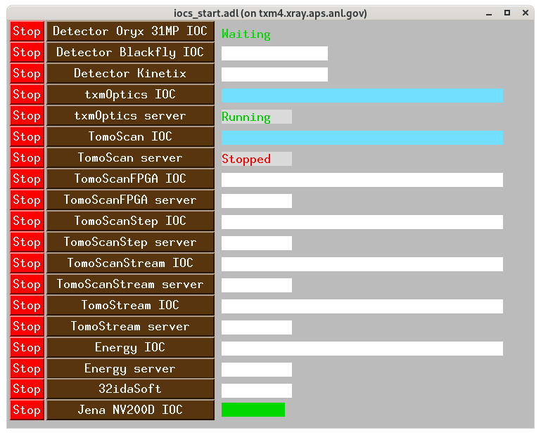
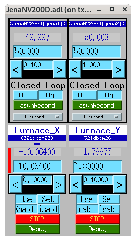

===========
Jena NV200D
===========

The Jena NV200D/NET controllers drive two piezo axes (X and Y) of the
coded-aperture flexure stage at 32-ID. They were relocated from 2-BM
(see the 2-BM ``item_028`` operation page for the previous deployment)
and re-addressed on the 32-ID private subnet. Both controllers are
now driven from an EPICS IOC (``JenaNV200D``) running on ``txm4`` as
``usertxm``, and are integrated with the FPGA trigger for triggered-step
tomography acquisitions.

EPICS IOC startup
=================

The IOC runs on ``txm4`` under procServ (in a detached ``screen``
session named ``JenaNV200D``). Start / stop via the wrapper scripts::

  (base) usertxm@txm4 ~ $ ~/scripts/JenaNV200D_IOC.sh        # start
  (base) usertxm@txm4 ~ $ ~/scripts/JenaNV200D_IOC_stop.sh   # stop

Under the hood each wrapper does ``ssh usertxm@txm4`` then invokes
``JenaNV200D.pl start`` / ``stop``::

  /net/s32dserv/xorApps/epics/synApps_6_3/ioc/JenaNV200D/iocBoot/iocJenaNV200D/softioc/JenaNV200D.pl

The IOC can also be started and stopped from the **iocs_start** MEDM
screen (row ``Jena NV200D IOC`` at the bottom). Launch that screen with::

  (base) usertxm@txm4 ~ $ ~/scripts/start_iocs

The status rectangle next to the start/stop buttons goes solid when
the IOC is up (watches ``JenaNV200D:jena1:twv.VAL``).

   iocs_start control screen at 32-ID, showing the ``Jena NV200D IOC``
   entry with start/stop buttons and status indicator.

To attach to the running IOC console::

  (base) usertxm@txm4 ~ $ screen -r JenaNV200D

Console log:
``/net/s32dserv/xorApps/epics/synApps_6_3/ioc/JenaNV200D/iocBoot/iocJenaNV200D/softioc/logs/iocConsole/``.

Network configuration
=====================

Controller IP addresses::

  X: 10.54.102.8    (piexo3.xray.aps.anl.gov, MAC 00:80:A3:6F:BD:6E)
  Y: 10.54.102.46   (piexo4.xray.aps.anl.gov, MAC 00:80:A3:6F:BD:64)

.. note::

   Only one Telnet connection is allowed at a time. The EPICS IOC must be
   stopped before running the triggered-step Python script (see
   `Triggered step mode`_), and restarted afterwards.

Device configuration
====================

At 32-ID the Lantronix XPorts on both controllers are set to **Flow 05
(XON_XOFF_PASS_TO_HOST)**. This is the mode the ``nv200`` Python
library sets on connect (``auto_adjust_comm_params=True``), and it
persists in the XPort's NVM across power cycles. Serial replies from
the controller come framed with XOFF/XON bytes wrapping the payload
(``\x13meas,-10.750\r\x00\n\x11``).

To keep the EPICS IOC working alongside the Python library, a **local
proto override** is installed in the IOC's ``iocBoot`` directory that
accepts the framed reply::

  /net/s32dserv/xorApps/epics/synApps_6_3/ioc/JenaNV200D/iocBoot/iocJenaNV200D/JenaNV100D.proto

Because ``STREAM_PROTOCOL_PATH=".:$(IP)/db"`` searches ``.`` first,
this local copy wins for this IOC only; the shared support-module
proto (``$(IP)/db/JenaNV100D.proto``) is untouched. The diff versus the
shared copy is a leading ``\x13`` on the ``in`` line of each ``read*``
transaction (readValue, readKp, readKi, readKd).

.. warning::

   Do NOT change the XPort back to ``Flow 01`` (plain XON/XOFF) without
   also removing the local proto override — the two are paired.
   Conversely, do not remove the override without first switching the
   XPort back to ``Flow 01`` and confirming no code path calls
   ``configure_flow_control(auto_adjust_comm_params=True)`` on the
   ``nv200`` library (which would flip it back to Flow 05 silently).

MEDM control screens
====================

Launch the Jena NV200D control panel with::

  (base) usertxm@txm4 ~ $ ~/scripts/start_jena200D

The panel loads the local ``JenaNV200D.adl`` (copied from the 2-BM
support install) with the 32-ID macros::

  P=JenaNV200D:, M1=jena1:, M2=jena2:, P1=32idb:, M20=m25, M21=m26

Both channels are in closed loop by default (``JenaNV200D:jena1:cl``,
``JenaNV200D:jena2:cl`` = ``On``). Setpoint and readback are in µm
over the 0–100 µm stroke.

   Jena NV200D MEDM control screen showing both axes in closed-loop
   mode.

caqtdm interface
================

Start the caqtdm interface::

  (base) usertxm@txm4 ~ $ /net/s32dserv/xorApps/epics/synApps_6_3/ioc/JenaNV200D/iocBoot/iocJenaNV200D/softioc/JenaNV200D.pl caqtdm

FPGA trigger integration
========================

The FPGA sends a TTL pulse to the NV200D controllers to step to the
next position during the camera readout interval. The JenaX and JenaY
signals are routed to **FPGA out2** and **out3** respectively.

The delay before each pulse is set via two softGlue PVs (units:
number of 10 MHz clock cycles, i.e. 100 ns per unit)::

  32idMZ1:SG:GateDly-2_DLY    # X axis delay
  32idMZ1:SG:GateDly-3_DLY    # Y axis delay

Set the DLY field to the detector exposure time plus a safety margin.
For the full softGlue chain (PSO → GateDly → JenaX/Y → FPGA out), see
the "Softglue configuration for the coded-aperture fly-scan" subsection
of :doc:`manual_020`.

Triggered step mode
===================

Up to 1024 positions can be pre-loaded into each controller's waveform
buffer. Each rising TTL edge on the **TRG IN** connector (pin 3 of the
I/O D-Sub, 0/3.3–5 V) advances the actuator to the next position.

.. warning::

   Stop the EPICS IOC before running the script — only one Telnet
   connection is allowed at a time. Restart the IOC when done.

Activate the dedicated ``nv200`` conda env (Python 3.12,
``/home/beams/USERTXM/conda/anaconda/envs/nv200``), which already has
the required ``nv200`` + ``numpy`` libraries installed::

  conda activate nv200

To recreate the env from scratch::

  conda create -n nv200 python=3.12 -y
  conda activate nv200
  pip install nv200 numpy

The script lives in the ``32id-procedures`` repository
(`procedures/nv200_trigger_step.py
<https://github.com/xray-imaging/32id-procedures/blob/main/procedures/nv200_trigger_step.py>`__).
Change to that directory before invoking it — the script writes
``positions_x.txt`` / ``positions_y.txt`` to the current working
directory and looks for no input files. Run on a computer on the
beamline's private subnet (e.g. ``txm4``)::

  (base) usertxm@txm4 ~ $ ~/scripts/JenaNV200D_IOC_stop.sh
  (base) usertxm@txm4 ~ $ conda activate nv200
  (nv200) usertxm@txm4 ~ $ cd ~/conda/32id-procedures-decarlof/procedures
  (nv200) usertxm@txm4 ~/.../procedures $ python nv200_trigger_step.py [--n N] [--random]

Arguments:

- ``--n N`` — number of positions to load (default: 256, max: 1024)
- ``--random`` — use random positions instead of evenly spaced (linspace)

See the procedure page :doc:`../procedures/item_013` for the formal
procedure definition (preconditions, parameters, steps,
postconditions, failure modes) that this operational walk-through
implements.

Example output::

  Connecting to X (10.54.102.8)...
  Connecting to Y (10.54.102.46)...
  --- X axis ---
    Actuator stroke: 0.0 … 100.0 µm
    Auto-generated 256 evenly-spaced positions.
    Loading 256 positions into buffer...
      128/256
      256/256
    Running. 256 positions loaded. Current position: 0.000 µm
  --- Y axis ---
    Actuator stroke: 0.0 … 100.0 µm
    Auto-generated 256 evenly-spaced positions.
    Loading 256 positions into buffer...
      128/256
      256/256
    Running. 256 positions loaded. Current position: 0.000 µm

  Running. Each rising edge on TRG IN (I/O connector pin 3) steps to the next position.
  Press Enter to stop...
  Stopping...
  Stopped. Manual control restored.

When the script exits cleanly (Enter pressed), its ``finally`` block
now also calls ``pid.set_mode(CLOSED_LOOP)`` and ``move_to_position(0.0)``
on each device before closing. That restores serial-driven setpoint
control, so the IOC can move the piezo as soon as you restart it.

If a Python session is killed uncleanly (kill -9, crash) and the
IOC's ``JenaNV200D:jena1:write`` no longer moves the piezo, the
controller is stuck in waveform / trigger-driven mode. Recover with
the reset helper::

  (base) usertxm@txm4 ~ $ bash ~/claude/nv200/09_reset_controller.sh

which stops the IOC, uses the library to reset the controllers, and
restarts the IOC.

Restart the IOC when done::

  (base) usertxm@txm4 ~ $ ~/scripts/JenaNV200D_IOC.sh

.. note::

   Positions are stored in the controller's RAM and are lost on power
   cycle. Once operation is confirmed, they can be persisted to EEPROM
   using the ``save_to_eeprom()`` method in the library.
